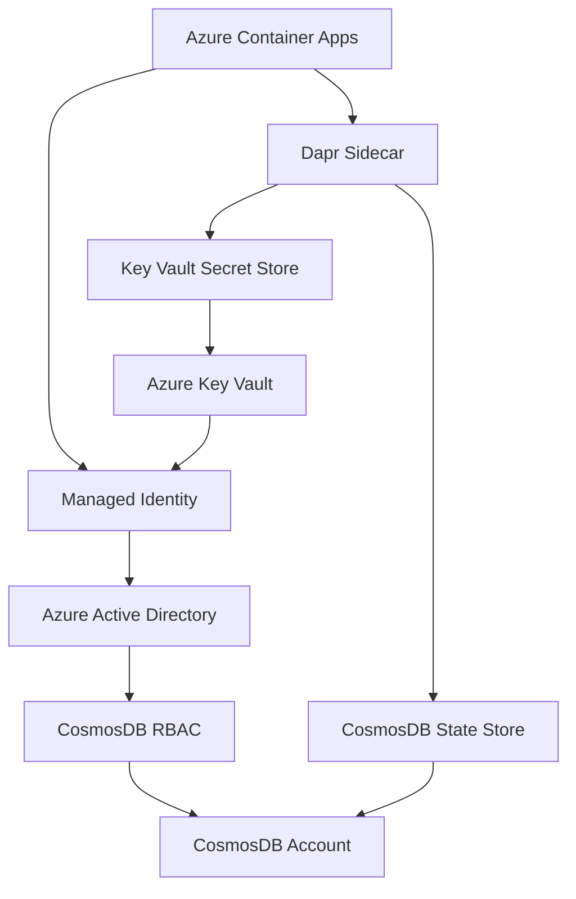

# Azure Container Apps with Managed Identity for CosmosDB

## Overview

Azure Container Apps with Managed Identity provides the most secure way to connect to CosmosDB without storing sensitive keys in configuration files. This approach uses Azure Active Directory authentication and eliminates the need for connection strings or master keys.

## Architecture Overview



## Configuration Changes Made

### 1. Updated CosmosDB Components (Keyless Authentication)

All three CosmosDB state store components have been updated to use Managed Identity:

#### Before (with keys):
```yaml
metadata:
- name: masterKey
  value: "{env:COSMOS_WORKFLOWS_KEY}"  # ❌ Security risk
```

#### After (with Managed Identity):
```yaml
metadata:
- name: azureEnvironment
  value: "AzurePublicCloud"
auth:
  secretStore: azure-keyvault  # ✅ Secure keyless auth
```

### 2. Azure Key Vault Integration

Created `azure-keyvault.yaml` component for secret management:

```yaml
apiVersion: dapr.io/v1alpha1
kind: Component
metadata:
  name: azure-keyvault
spec:
  type: secretstores.azure.keyvault
  version: v1
  metadata:
  - name: vaultName
    value: "{env:AZURE_KEYVAULT_NAME}"
  - name: azureEnvironment
    value: "AzurePublicCloud"
  - name: azureTenantId
    value: "{env:AZURE_TENANT_ID}"
  - name: azureClientId
    value: "{env:AZURE_CLIENT_ID}"
```

## Azure Infrastructure Setup

### 1. Create Managed Identity

```bash
# Create user-assigned managed identity
az identity create \
  --resource-group dapr-agents-rg \
  --name dapr-agents-identity \
  --location eastus

# Get identity details
IDENTITY_ID=$(az identity show \
  --resource-group dapr-agents-rg \
  --name dapr-agents-identity \
  --query id --output tsv)

IDENTITY_CLIENT_ID=$(az identity show \
  --resource-group dapr-agents-rg \
  --name dapr-agents-identity \
  --query clientId --output tsv)

IDENTITY_PRINCIPAL_ID=$(az identity show \
  --resource-group dapr-agents-rg \
  --name dapr-agents-identity \
  --query principalId --output tsv)
```

### 2. Configure CosmosDB RBAC

```bash
# Create custom role for CosmosDB access
az cosmosdb sql role definition create \
  --account-name your-cosmos-account \
  --resource-group dapr-agents-rg \
  --body '{
    "RoleName": "DaprAgentsCosmosRole",
    "Type": "CustomRole",
    "AssignableScopes": ["/"],
    "Permissions": [{
      "DataActions": [
        "Microsoft.DocumentDB/databaseAccounts/readMetadata",
        "Microsoft.DocumentDB/databaseAccounts/sqlDatabases/containers/items/*",
        "Microsoft.DocumentDB/databaseAccounts/sqlDatabases/containers/*"
      ]
    }]
  }'

# Get the role definition ID
ROLE_DEF_ID=$(az cosmosdb sql role definition list \
  --account-name your-cosmos-account \
  --resource-group dapr-agents-rg \
  --query "[?roleName=='DaprAgentsCosmosRole'].id" --output tsv)

# Assign role to managed identity
az cosmosdb sql role assignment create \
  --account-name your-cosmos-account \
  --resource-group dapr-agents-rg \
  --scope "/" \
  --principal-id $IDENTITY_PRINCIPAL_ID \
  --role-definition-id $ROLE_DEF_ID
```

### 3. Create Azure Key Vault

```bash
# Create Key Vault
az keyvault create \
  --name dapr-agents-keyvault \
  --resource-group dapr-agents-rg \
  --location eastus \
  --enable-rbac-authorization true

# Grant managed identity access to Key Vault
az role assignment create \
  --role "Key Vault Secrets User" \
  --assignee $IDENTITY_PRINCIPAL_ID \
  --scope $(az keyvault show --name dapr-agents-keyvault --query id --output tsv)
```

### 4. Create Container App Environment

```bash
# Create Container Apps environment
az containerapp env create \
  --name dapr-agents-env \
  --resource-group dapr-agents-rg \
  --location eastus \
  --enable-dapr true \
  --dapr-instrumentation-key "{your-app-insights-key}"
```

### 5. Deploy Container App with Managed Identity

```yaml
# container-app.yaml
apiVersion: apps/v1
kind: ContainerApp
metadata:
  name: dapr-agents-app
spec:
  managedEnvironmentId: /subscriptions/{subscription}/resourceGroups/dapr-agents-rg/providers/Microsoft.App/managedEnvironments/dapr-agents-env
  configuration:
    activeRevisionsMode: single
    dapr:
      enabled: true
      appId: dapr-agents
      appProtocol: http
      appPort: 3000
    ingress:
      external: true
      targetPort: 3000
    secrets:
    - name: azure-tenant-id
      value: "{your-tenant-id}"
    - name: azure-client-id
      value: "{managed-identity-client-id}"
  identity:
    type: UserAssigned
    userAssignedIdentities:
      /subscriptions/{subscription}/resourceGroups/dapr-agents-rg/providers/Microsoft.ManagedIdentity/userAssignedIdentities/dapr-agents-identity: {}
  template:
    containers:
    - name: dapr-agents
      image: your-registry.azurecr.io/dapr-agents:latest
      env:
      - name: AZURE_TENANT_ID
        secretRef: azure-tenant-id
      - name: AZURE_CLIENT_ID
        secretRef: azure-client-id
      - name: AZURE_KEYVAULT_NAME
        value: dapr-agents-keyvault
      - name: COSMOS_WORKFLOWS_URL
        value: https://your-workflows-cosmos.documents.azure.com:443/
      - name: COSMOS_AGENTS_URL
        value: https://your-agents-cosmos.documents.azure.com:443/
      - name: COSMOS_CACHE_URL
        value: https://your-cache-cosmos.documents.azure.com:443/
      - name: USE_MANAGED_IDENTITY
        value: "true"
    scale:
      minReplicas: 1
      maxReplicas: 10
```

### 6. Deploy with Azure CLI

```bash
# Deploy the container app
az containerapp create \
  --name dapr-agents-app \
  --resource-group dapr-agents-rg \
  --environment dapr-agents-env \
  --image your-registry.azurecr.io/dapr-agents:latest \
  --user-assigned $IDENTITY_ID \
  --env-vars \
    AZURE_TENANT_ID="$AZURE_TENANT_ID" \
    AZURE_CLIENT_ID="$IDENTITY_CLIENT_ID" \
    AZURE_KEYVAULT_NAME="dapr-agents-keyvault" \
    COSMOS_WORKFLOWS_URL="https://your-workflows-cosmos.documents.azure.com:443/" \
    COSMOS_AGENTS_URL="https://your-agents-cosmos.documents.azure.com:443/" \
    COSMOS_CACHE_URL="https://your-cache-cosmos.documents.azure.com:443/" \
    USE_MANAGED_IDENTITY="true" \
  --dapr-enabled true \
  --dapr-app-id dapr-agents \
  --dapr-app-port 3000 \
  --ingress external \
  --target-port 3000 \
  --min-replicas 1 \
  --max-replicas 10
```

## Application Code Changes

### 1. Environment Detection

```typescript
// src/utils/auth.ts
export interface AzureAuthConfig {
  useManagedIdentity: boolean;
  tenantId?: string;
  clientId?: string;
  keyVaultName?: string;
}

export function getAzureAuthConfig(): AzureAuthConfig {
  const useManagedIdentity = process.env.USE_MANAGED_IDENTITY === 'true';
  
  return {
    useManagedIdentity,
    tenantId: process.env.AZURE_TENANT_ID,
    clientId: process.env.AZURE_CLIENT_ID,
    keyVaultName: process.env.AZURE_KEYVAULT_NAME
  };
}

export function validateManagedIdentityConfig(): void {
  const config = getAzureAuthConfig();
  
  if (config.useManagedIdentity) {
    if (!config.tenantId || !config.clientId || !config.keyVaultName) {
      throw new Error(
        'Managed Identity requires AZURE_TENANT_ID, AZURE_CLIENT_ID, and AZURE_KEYVAULT_NAME'
      );
    }
    
    console.log('✅ Using Azure Managed Identity for CosmosDB authentication');
    console.log(`   Tenant ID: ${config.tenantId}`);
    console.log(`   Client ID: ${config.clientId}`);
    console.log(`   Key Vault: ${config.keyVaultName}`);
  } else {
    console.log('⚠️  Using connection strings for CosmosDB authentication');
  }
}
```

### 2. State Store Configuration

```typescript
// src/utils/statestore-managed-identity.ts
import { getAzureAuthConfig } from './auth';

export interface ManagedIdentityStateStoreConfig {
  workflows: string;
  agents: string;
  cache: string;
  fallback: string;
  authMethod: 'managed-identity' | 'connection-string';
}

export function getManagedIdentityStateStoreConfig(): ManagedIdentityStateStoreConfig {
  const authConfig = getAzureAuthConfig();
  const environment = process.env.NODE_ENV || 'development';
  
  if (environment === 'production' && authConfig.useManagedIdentity) {
    return {
      workflows: "statestore-workflows-cosmos",
      agents: "statestore-agents-cosmos",
      cache: "statestore-cache-cosmos",
      fallback: "statestore",
      authMethod: 'managed-identity'
    };
  } else if (environment === 'production') {
    return {
      workflows: "statestore-workflows-cosmos",
      agents: "statestore-agents-cosmos", 
      cache: "statestore-cache-cosmos",
      fallback: "statestore",
      authMethod: 'connection-string'
    };
  } else {
    // Development - use local storage
    return {
      workflows: "statestore",
      agents: "statestore",
      cache: "statestore", 
      fallback: "statestore",
      authMethod: 'connection-string'
    };
  }
}
```

### 3. Application Startup

```typescript
// src/index.ts
import { validateManagedIdentityConfig, getAzureAuthConfig } from './utils/auth';
import { getManagedIdentityStateStoreConfig } from './utils/statestore-managed-identity';

async function main() {
  console.log('🚀 Starting Dapr Agents with Azure integration...');
  
  // Validate authentication configuration
  validateManagedIdentityConfig();
  
  const authConfig = getAzureAuthConfig();
  const stateStoreConfig = getManagedIdentityStateStoreConfig();
  
  console.log('🔧 State Store Configuration:');
  console.log(`   Workflows: ${stateStoreConfig.workflows}`);
  console.log(`   Agents: ${stateStoreConfig.agents}`);
  console.log(`   Cache: ${stateStoreConfig.cache}`);
  console.log(`   Auth Method: ${stateStoreConfig.authMethod}`);
  
  // Initialize application with managed identity support
  const app = new WorkflowApp({
    stateStoreConfig,
    authConfig,
    llm: getDefaultLLM(),
    timeout: 300
  });
  
  await app.start();
  console.log('✅ Dapr Agents started successfully with Managed Identity');
}

main().catch(console.error);
```

## Security Benefits

### 1. No Secrets in Configuration

**Before (Security Risk):**
```yaml
# ❌ Keys exposed in configuration
metadata:
- name: masterKey
  value: "AccountEndpoint=https://...;AccountKey=xyz123..."
```

**After (Secure):**
```yaml
# ✅ No secrets in configuration
metadata:
- name: azureEnvironment
  value: "AzurePublicCloud"
auth:
  secretStore: azure-keyvault
```

### 2. Automatic Key Rotation

```bash
# CosmosDB keys can be rotated without application changes
az cosmosdb keys regenerate \
  --name your-cosmos-account \
  --resource-group dapr-agents-rg \
  --key-kind primary
# Application continues working - no restart needed!
```

### 3. Fine-Grained RBAC

```json
{
  "RoleName": "DaprAgentsCosmosRole",
  "Type": "CustomRole", 
  "Permissions": [{
    "DataActions": [
      "Microsoft.DocumentDB/databaseAccounts/readMetadata",
      "Microsoft.DocumentDB/databaseAccounts/sqlDatabases/containers/items/read",
      "Microsoft.DocumentDB/databaseAccounts/sqlDatabases/containers/items/create",
      "Microsoft.DocumentDB/databaseAccounts/sqlDatabases/containers/items/upsert",
      "Microsoft.DocumentDB/databaseAccounts/sqlDatabases/containers/items/delete"
    ]
  }]
}
```

## Monitoring and Troubleshooting

### 1. Check Managed Identity Status

```bash
# Verify managed identity assignment
az containerapp identity show \
  --name dapr-agents-app \
  --resource-group dapr-agents-rg

# Check CosmosDB role assignments
az cosmosdb sql role assignment list \
  --account-name your-cosmos-account \
  --resource-group dapr-agents-rg
```

### 2. Application Logs

```typescript
// Enhanced logging for managed identity
class ManagedIdentityLogger {
  static logAuthAttempt(component: string, success: boolean, error?: Error) {
    const timestamp = new Date().toISOString();
    
    if (success) {
      console.log(`✅ [${timestamp}] Managed Identity auth success for ${component}`);
    } else {
      console.error(`❌ [${timestamp}] Managed Identity auth failed for ${component}:`, error?.message);
    }
  }
  
  static logStateStoreOperation(stateStore: string, operation: string, success: boolean) {
    const timestamp = new Date().toISOString();
    console.log(`🔄 [${timestamp}] ${stateStore} ${operation}: ${success ? 'SUCCESS' : 'FAILED'}`);
  }
}
```

### 3. Azure Monitor Integration

```bash
# Enable diagnostic settings for CosmosDB
az monitor diagnostic-settings create \
  --name cosmos-diagnostics \
  --resource $(az cosmosdb show --name your-cosmos-account --resource-group dapr-agents-rg --query id --output tsv) \
  --logs '[{"category": "DataPlaneRequests", "enabled": true}]' \
  --workspace $(az monitor log-analytics workspace show --workspace-name your-workspace --resource-group dapr-agents-rg --query id --output tsv)
```

## Deployment Best Practices

### 1. Infrastructure as Code (Bicep)

```bicep
// main.bicep
param location string = resourceGroup().location
param appName string = 'dapr-agents'

// Managed Identity
resource managedIdentity 'Microsoft.ManagedIdentity/userAssignedIdentities@2023-01-31' = {
  name: '${appName}-identity'
  location: location
}

// CosmosDB Account
resource cosmosAccount 'Microsoft.DocumentDB/databaseAccounts@2023-04-15' = {
  name: '${appName}-cosmos'
  location: location
  properties: {
    databaseAccountOfferType: 'Standard'
    consistencyPolicy: {
      defaultConsistencyLevel: 'Session'
    }
    locations: [
      {
        locationName: location
        failoverPriority: 0
      }
    ]
  }
}

// Key Vault
resource keyVault 'Microsoft.KeyVault/vaults@2023-02-01' = {
  name: '${appName}-kv'
  location: location
  properties: {
    sku: {
      family: 'A'
      name: 'standard'
    }
    tenantId: tenant().tenantId
    enableRbacAuthorization: true
  }
}

// Container App Environment
resource containerAppEnvironment 'Microsoft.App/managedEnvironments@2023-05-01' = {
  name: '${appName}-env'
  location: location
  properties: {
    daprAIInstrumentationKey: appInsights.properties.InstrumentationKey
  }
}

// Container App
resource containerApp 'Microsoft.App/containerApps@2023-05-01' = {
  name: '${appName}-app'
  location: location
  identity: {
    type: 'UserAssigned'
    userAssignedIdentities: {
      '${managedIdentity.id}': {}
    }
  }
  properties: {
    managedEnvironmentId: containerAppEnvironment.id
    configuration: {
      dapr: {
        enabled: true
        appId: appName
        appPort: 3000
      }
    }
    template: {
      containers: [
        {
          name: appName
          image: 'your-registry.azurecr.io/dapr-agents:latest'
          env: [
            {
              name: 'AZURE_TENANT_ID'
              value: tenant().tenantId
            }
            {
              name: 'AZURE_CLIENT_ID'
              value: managedIdentity.properties.clientId
            }
            {
              name: 'USE_MANAGED_IDENTITY'
              value: 'true'
            }
          ]
        }
      ]
    }
  }
}
```

### 2. CI/CD Pipeline

```yaml
# azure-pipelines.yml
trigger:
- main

pool:
  vmImage: 'ubuntu-latest'

variables:
  resourceGroup: 'dapr-agents-rg'
  location: 'eastus'

stages:
- stage: Infrastructure
  jobs:
  - job: Deploy
    steps:
    - task: AzureCLI@2
      displayName: 'Deploy Infrastructure'
      inputs:
        azureSubscription: 'Azure Service Connection'
        scriptType: 'bash'
        scriptLocation: 'inlineScript'
        inlineScript: |
          az deployment group create \
            --resource-group $(resourceGroup) \
            --template-file infrastructure/main.bicep \
            --parameters appName=dapr-agents

- stage: Application
  dependsOn: Infrastructure
  jobs:
  - job: Deploy
    steps:
    - task: Docker@2
      displayName: 'Build and Push Image'
      inputs:
        command: 'buildAndPush'
        repository: 'dapr-agents'
        containerRegistry: 'Azure Container Registry'
        
    - task: AzureCLI@2
      displayName: 'Update Container App'
      inputs:
        azureSubscription: 'Azure Service Connection'
        scriptType: 'bash'
        scriptLocation: 'inlineScript'
        inlineScript: |
          az containerapp update \
            --name dapr-agents-app \
            --resource-group $(resourceGroup) \
            --image your-registry.azurecr.io/dapr-agents:$(Build.BuildNumber)
```

## Summary

Using Azure Managed Identity with CosmosDB in Container Apps provides:

1. **Enhanced Security**: No secrets in configuration files
2. **Automatic Key Rotation**: Keys rotate without application changes
3. **Fine-Grained Access**: RBAC controls exactly what the application can access
4. **Simplified Operations**: No manual key management
5. **Audit Trail**: All access is logged and monitored
6. **Compliance**: Meets enterprise security requirements

The updated configuration eliminates the need for `masterKey` parameters and instead uses Azure Active Directory authentication through Managed Identity, providing enterprise-grade security for your dapr-agents CosmosDB integration!