# Dapr Actor Runtime to Workflow Engine Transformation

## Overview

This document explains how Dapr's Actor Runtime transforms into a Workflow orchestration engine during system initialization, providing the foundation for durable workflow execution.

## Dapr System Initialization Process

### 1. Component Discovery & Loading

When Dapr starts (via the `daprd-start-agents` task), it follows this sequence:

```bash
# Your Dapr startup command
dapr run --app-id dapr-agents --dapr-http-port 3500 --dapr-grpc-port 50001 \
  --components-path ./components --config ./components/config.yaml
```

**Component Discovery Process:**
- Scans the `--components-path` directory (`./components`)
- Loads all `.yaml` component definition files
- Parses component metadata and configuration

### 2. Component Instantiation

Dapr instantiates each component based on its type:

#### Your Project's Components:

**`config.yaml`** - Main Dapr configuration:
```yaml
apiVersion: dapr.io/v1alpha1
kind: Configuration
metadata:
  name: dapr-config
spec:
  features:
    - name: "conversation"
      enabled: true
  accessControl:
    defaultAction: allow
```

**`statestore.yaml`** - Critical for workflows:
```yaml
apiVersion: dapr.io/v1alpha1
kind: Component
metadata:
  name: statestore
spec:
  type: state.in-memory
  version: v1
  metadata:
  - name: actorStateStore
    value: "true"  # ← This is the KEY setting!
```

**`azure-openai.yaml`** - LLM component:
```yaml
apiVersion: dapr.io/v1alpha1
kind: Component
metadata:
  name: azure-openai-compatible
spec:
  type: conversation.openai
  version: v1
```

**`messagepubsub.yaml`** - Messaging component:
```yaml
apiVersion: dapr.io/v1alpha1
kind: Component
metadata:
  name: messagepubsub
spec:
  type: pubsub.redis
  version: v1
```

### 3. Sidecar Runtime Startup

The Dapr sidecar initializes:
- **HTTP API** on `--dapr-http-port` (port 3500)
- **gRPC API** on `--dapr-grpc-port` (port 50001)
- **Actor runtime** with state store integration
- **Component health checking**

### 4. Wait State

The sidecar enters ready state to:
- Receive HTTP/gRPC calls from applications
- Route requests to pre-initialized components
- Handle actor/workflow orchestration
- Manage state, messaging, and other operations

## Actor Runtime → Workflow Engine Transformation

### 1. Dapr's Built-in Workflow Actor

When Dapr starts with your components, it automatically registers a special built-in actor type:

```typescript
// Internally, Dapr registers:
actorRuntime.registerActorType("dapr.workflow.engine", WorkflowEngineActor);
```

**Key Points:**
- This is a **built-in** actor type provided by Dapr
- It uses your `statestore.yaml` component for persistence
- No external application required (why removing `--app-port` fixed the issue)

### 2. Workflow Scheduling Translation

When your TypeScript code calls:

```typescript
await wfClient.scheduleNewWorkflow('extended_task_chain', undefined, instanceId);
```

**Behind the scenes**, Dapr translates this to an actor invocation:

```typescript
// Dapr internally converts to:
await actorProxy.invokeMethod("dapr.workflow.engine", instanceId, "StartWorkflow", {
  workflowType: "extended_task_chain",
  input: undefined
});
```

### 3. The Workflow Engine Actor Capabilities

The `dapr.workflow.engine` actor provides:

- **Durable State Management**: Uses your `statestore.yaml` for persistence
- **Activity Orchestration**: Manages calls to your registered tasks
- **Workflow Lifecycle**: Handles scheduling, execution, completion
- **Fault Tolerance**: Survives restarts and failures
- **Concurrency Control**: Single-threaded execution per workflow instance

### 4. State Persistence Flow

Example from your workflow execution:

```typescript
// From sequential-workflow.ts
const extendedWorkflow = async (ctx: WorkflowContext, input: any) => {
  // Step 1: Get character
  console.log('📝 Step 1: Calling get_character activity...');
  const character = await ctx.callActivity('get_character', {});
  console.log('✅ Step 1 completed, character:', character);
  
  // Step 2: Get famous line  
  console.log('📝 Step 2: Calling get_line activity...');
  const famousLine = await ctx.callActivity('get_line', { character });
  console.log('✅ Step 2 completed, famous line:', famousLine);
  
  // Step 3: Analyze quote
  console.log('📝 Step 3: Calling analyze_quote activity...');
  const analysis = await ctx.callActivity('analyze_quote', { 
    character, 
    quote: famousLine 
  });
  console.log('✅ Step 3 completed, analysis:', analysis);
  
  return { character, quote: famousLine, analysis };
};
```

**Each `ctx.callActivity()` call:**

1. **State Persistence**: Workflow engine actor saves current state to `statestore`
2. **Task Invocation**: Calls your registered task function
3. **Result Storage**: Saves task result back to state store  
4. **State Update**: Updates workflow progress
5. **Continuation**: Proceeds to next step or completes

### 5. Complete Execution Flow

```mermaid
graph TD
    A[Your Code: wfClient.scheduleNewWorkflow] --> B[Dapr HTTP/gRPC API]
    B --> C[Actor Runtime]
    C --> D[dapr.workflow.engine Actor Instance]
    D --> E[State Store: statestore.yaml]
    D --> F[Execute: ctx.callActivity]
    F --> G[Your Registered Task Functions]
    G --> H[Task Results → State Store]
    H --> I[Workflow Completion]
    
    E --> J[Actor State Persistence]
    J --> K[Durable Execution]
    K --> L[Fault Tolerance]
```



## Why Configuration Matters

### The Critical `actorStateStore` Setting

In your `statestore.yaml`:

```yaml
metadata:
- name: actorStateStore
  value: "true"  # This enables actor state persistence
```

**Without this setting:**
- Actors cannot persist state
- Workflows cannot survive restarts
- `scheduleNewWorkflow` calls fail

**With this setting:**
- Actor runtime can use this state store
- Workflow engine actor can persist workflow state
- Durable workflow execution is enabled

### Why Removing `--app-port` Fixed the Issue

The `--app-port 3000` parameter tells Dapr:
> "Forward actor calls to an application running on port 3000"

**The Problem:**
- Dapr was trying to forward `dapr.workflow.engine` actor calls to port 3000
- No application was listening on port 3000 to handle actor callbacks
- This caused the "DaprBuiltInActorNotFoundRetries" errors
- Workflow scheduling hung waiting for responses

**The Solution:**
By removing `--app-port`, you told Dapr:
> "Use your built-in actors, including the workflow engine"

**Result:**
- Dapr uses its internal `dapr.workflow.engine` actor
- No external application needed
- Workflows execute successfully

## Runtime Readiness Indicators

When you see these messages, the transformation is complete:

```
✅ Workflow runtime started successfully
```

This means:
- ✅ Actor runtime is running
- ✅ `dapr.workflow.engine` actor type is registered  
- ✅ State store (`statestore.yaml`) is connected and ready
- ✅ Your workflow/task registrations are cached in memory
- ✅ HTTP/gRPC APIs are listening for `scheduleNewWorkflow` calls
- ✅ Durable workflow execution is enabled

## Task Registration and Execution

### How Tasks Become Activities

When you register tasks in your `WorkflowApp`:

```typescript
// From your workflow examples
wfApp.registerTask('get_character', getCharacter);
wfApp.registerTask('get_line', getLine);
wfApp.registerTask('analyze_quote', analyzeQuote);
wfApp.registerTask('generate_context', generateContext);
```

**Internal Process:**
1. `WorkflowApp` stores task functions in a `Map<string, Function>`
2. `WorkflowRuntime.registerActivityWithName()` registers with Dapr
3. Dapr actor runtime can now invoke these as workflow activities
4. `ctx.callActivity()` calls route through the workflow engine actor

### Activity Execution Flow

```typescript
// When workflow calls:
const character = await ctx.callActivity('get_character', {});

// Execution path:
// 1. Workflow engine actor receives callActivity request
// 2. Actor persists current workflow state
// 3. Actor invokes registered 'get_character' function  
// 4. Function executes and returns result
// 5. Actor saves result to state store
// 6. Actor returns result to workflow context
// 7. Workflow continues to next step
```

## Configuration Best Practices

### Essential Components for Workflows

1. **State Store with Actor Support:**
```yaml
spec:
  type: state.in-memory  # or state.redis, state.postgresql, etc.
  metadata:
  - name: actorStateStore
    value: "true"  # REQUIRED for workflows
```

2. **Dapr Configuration with Features:**
```yaml
spec:
  features:
    - name: "conversation"  # If using LLM components
      enabled: true
```

3. **No App Port for Standalone Workflows:**
```bash
# Correct for standalone workflows
dapr run --app-id my-workflows --dapr-http-port 3500 --dapr-grpc-port 50001

# Incorrect - causes hanging
dapr run --app-id my-workflows --app-port 3000 --dapr-http-port 3500
```

### Development vs Production

**Development (In-Memory State):**
```yaml
spec:
  type: state.in-memory
  metadata:
  - name: actorStateStore
    value: "true"
```

**Production (Persistent State):**
```yaml
spec:
  type: state.redis  # or state.postgresql, state.cosmosdb
  metadata:
  - name: redisHost
    value: "localhost:6379"
  - name: actorStateStore
    value: "true"
```

## Troubleshooting

### Common Issues

1. **Workflows Hang at `scheduleNewWorkflow`:**
   - **Cause**: `--app-port` specified but no actor host application
   - **Solution**: Remove `--app-port` for standalone workflows

2. **"DaprBuiltInActorNotFoundRetries" Errors:**
   - **Cause**: Actor runtime cannot find workflow engine actor
   - **Solution**: Ensure no `--app-port` and state store has `actorStateStore: "true"`

3. **State Not Persisting:**
   - **Cause**: State store not configured as actor state store
   - **Solution**: Add `actorStateStore: "true"` to state store metadata

4. **Tasks Not Found:**
   - **Cause**: Tasks not registered before workflow execution
   - **Solution**: Ensure `registerTask()` calls before `startRuntime()`

### Debug Commands

```bash
# Check Dapr processes
dapr list

# View Dapr logs
dapr logs --app-id dapr-agents

# Check component status
curl http://localhost:3500/v1.0/components
```

## Summary

The Actor Runtime becomes a Workflow orchestration engine through this transformation:

1. **Component Loading**: Dapr loads your state store with `actorStateStore: "true"`
2. **Actor Registration**: Dapr registers built-in `dapr.workflow.engine` actor type
3. **State Integration**: Workflow engine actor uses your state store for persistence  
4. **API Exposure**: HTTP/gRPC APIs expose workflow scheduling capabilities
5. **Task Integration**: Your registered tasks become workflow activities
6. **Durable Execution**: Actor state persistence enables fault-tolerant workflows

The key insight is that **workflows are implemented as special actors** in Dapr, and your state store configuration determines whether this actor-to-workflow transformation succeeds.