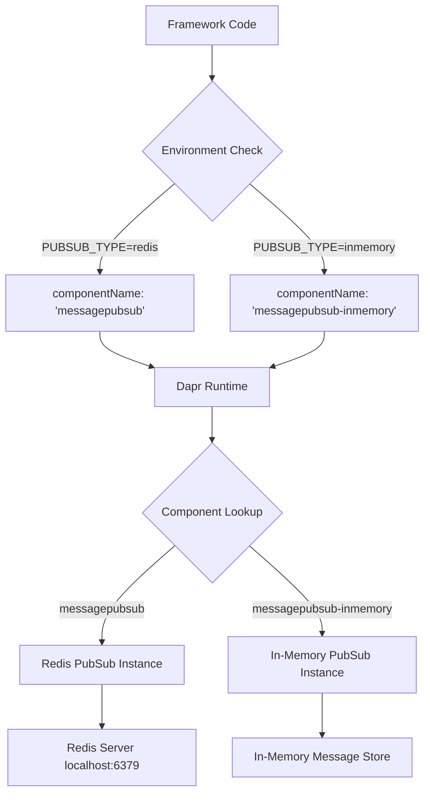

# Dapr Multiple Component Discovery and Runtime Routing

## Overview

This document explains how Dapr discovers, initializes, and routes to multiple components of the same type during system startup and runtime execution within the dapr-agents framework.

## Your Multiple Component Setup

Based on your `components/` directory, you have multiple components of the same type:

### Pub/Sub Components (Same Type)
```yaml
# messagepubsub.yaml
metadata:
  name: messagepubsub
spec:
  type: pubsub.redis
  
# messagepubsub-inmemory.yaml  
metadata:
  name: messagepubsub-inmemory
spec:
  type: pubsub.in-memory
```

### State Store Components (Same Type)
```yaml
# statestore.yaml
metadata:
  name: statestore
spec:
  type: state.in-memory

# statestore-redis.yaml.disabled
metadata:
  name: statestore-redis
spec:
  type: state.redis
```

## Dapr Component Discovery Process

### 1. Initialization Phase

When Dapr starts with your configuration:

```bash
dapr run --app-id dapr-agents --dapr-http-port 3500 --dapr-grpc-port 50001 \
  --components-path ./components --config ./components/config.yaml
```

**Discovery Process:**

1. **Scan Components Directory**: Dapr recursively scans `./components/`
2. **Parse YAML Files**: Loads all `.yaml` files (ignores `.disabled` files)
3. **Component Registration**: Creates internal component registry by **name**
4. **Type Validation**: Validates each component's `spec.type` against available providers
5. **Scope Filtering**: Applies `scopes` restrictions (your components scope to `dapr-agents`)

**Result**: Component registry contains:
```
Component Registry:
├── messagepubsub (type: pubsub.redis)
├── messagepubsub-inmemory (type: pubsub.in-memory)  
├── statestore (type: state.in-memory)
├── azure-openai-compatible (type: conversation.openai)
└── [statestore-redis.yaml.disabled - IGNORED]
```

### 2. Component Instantiation

Dapr instantiates **each component separately** by name:

```typescript
// Internal Dapr process (conceptual)
const components = {
  "messagepubsub": new RedisPubSub({
    redisHost: "localhost:6379",
    redisPassword: "",
    redisDB: "0"
  }),
  "messagepubsub-inmemory": new InMemoryPubSub({
    // No external dependencies
  }),
  "statestore": new InMemoryStateStore({
    actorStateStore: true
  }),
  "azure-openai-compatible": new OpenAIConversation({
    endpoint: process.env.AZURE_OPENAI_ENDPOINT,
    key: process.env.OPENAI_API_KEY
  })
};
```

**Key Points:**
- Each component has a **unique name** as the identifier
- Multiple components of the same **type** can coexist
- Components are instantiated **independently** with their own configurations
- `.disabled` files are completely ignored during discovery

## Runtime Component Routing

### 1. Component Selection by Name

When your dapr-agents framework makes Dapr API calls, components are selected **by name**:

```typescript
// From your PubSubMixin usage
await client.pubsub.publish(
  pubsubName,  // Component name: "messagepubsub" or "messagepubsub-inmemory"
  topicName,   // Topic within that component
  message
);
```

### 2. Dynamic Component Selection

Your framework implements **environment-driven component selection**:

```typescript
// From src/utils/pubsub.ts
export function getPubSubConfig(): PubSubConfig {
  const pubsubType = (process.env.PUBSUB_TYPE || 'redis').toLowerCase();
  
  const configs: Record<string, PubSubConfig> = {
    redis: {
      componentName: 'messagepubsub',        // Routes to Redis component
      type: 'redis',
      description: 'Redis-based pubsub (production-ready, persistent)'
    },
    inmemory: {
      componentName: 'messagepubsub-inmemory', // Routes to in-memory component
      type: 'inmemory', 
      description: 'In-memory pubsub (testing/development, not persistent)'
    }
  };

  return configs[pubsubType];
}
```

**Usage in Framework:**
```typescript
// Runtime component selection
const pubsubConfig = getPubSubConfig();
await PubSubMixin.publishMessage(
  context,
  pubsubConfig.componentName,  // Dynamically selects component
  topicName,
  message
);
```

### 3. Message Routing Flow

When messages are published/consumed, Dapr routes by component name:



## Framework Integration Patterns

### 1. Configuration-Driven Routing

Your LLM Orchestrator uses configuration to specify component names:

```typescript
// From LLM Orchestrator configuration
const config = {
  messageBusName: "messagepubsub",           // Component name
  stateStoreName: "statestore",              // Component name  
  agentsRegistryStoreName: "statestore",     // Component name
  broadcastTopicName: "broadcast_channel"    // Topic within component
};

// Runtime usage
await daprClient.pubsub.publish(
  this.messageBusName,    // "messagepubsub" - routes to specific component
  this.broadcastTopicName, // Topic within that component
  message
);
```

### 2. Topic-based Message Routing

Within a single component, your framework uses **topics** for logical separation:

```typescript
// From orchestrator message routing
async broadcastMessageToAgents(input: any): Promise<void> {
  await daprClient.pubsub.publish(
    this.messageBusName,         // Component: "messagepubsub"
    this.broadcastTopicName,     // Topic: "broadcast_channel"
    input.message
  );
}

async triggerAgentTask(input: any): Promise<any> {
  await daprClient.pubsub.publish(
    this.messageBusName,         // Same component: "messagepubsub"  
    `agent_${input.agentName}`,  // Different topic: "agent_specific"
    taskMessage
  );
}
```

### 3. CloudEvent Type Routing

Your `PubSubMixin` implements **message type routing** within topics:

```typescript
// From PubSubMixin.routeMessage()
static async routeMessage(
  pubsubName: string,    // Component name
  topicName: string,     // Topic within component
  message: any
): Promise<{ status: 'success' | 'drop' | 'retry'; result?: any }> {
  
  const topicKey = `${pubsubName}:${topicName}`;
  const handlerMap = this._topicHandlers?.get(topicKey);
  
  // Extract CloudEvent metadata
  const { eventData, metadata } = PubSubMixin.extractCloudEventData(message);
  const eventType = metadata.type;
  
  // Route by event type within the topic
  const routeEntry = handlerMap.get(eventType || '');
  if (routeEntry) {
    const { schema, handler } = routeEntry;
    const result = await handler(parsedMessage);
    return { status: 'success', result };
  }
}
```

## Component Isolation and Independence

### 1. Independent Lifecycle

Each component operates independently:

```yaml
# messagepubsub.yaml - Redis component
spec:
  type: pubsub.redis
  metadata:
  - name: redisHost
    value: "localhost:6379"  # Requires Redis server
    
# messagepubsub-inmemory.yaml - In-memory component  
spec:
  type: pubsub.in-memory
  metadata: []              # No external dependencies
```

**Benefits:**
- **Failure Isolation**: If Redis is down, in-memory component still works
- **Performance Characteristics**: Different latency/throughput profiles
- **Development vs Production**: Easy environment switching

### 2. Configuration Isolation

Components maintain separate configurations:

```typescript
// Redis component configuration
{
  redisHost: "localhost:6379",
  redisPassword: "",
  redisDB: "0",
  persistent: true,
  distributed: true
}

// In-memory component configuration  
{
  maxMessages: 10000,
  persistent: false,
  distributed: false
}
```

### 3. State Isolation

Each component maintains its own state:

- **Redis PubSub**: Messages stored in Redis server
- **In-Memory PubSub**: Messages stored in Dapr sidecar memory
- **Independent Topics**: Each component has its own topic namespace

## Runtime Selection Strategies

### 1. Environment-Based Selection

```typescript
// Development
process.env.PUBSUB_TYPE = "inmemory";
// Uses: messagepubsub-inmemory

// Production  
process.env.PUBSUB_TYPE = "redis";
// Uses: messagepubsub
```

### 2. Feature-Based Selection

```typescript
// High-throughput scenarios
if (messageVolume > 1000) {
  componentName = "messagepubsub";        // Redis for performance
} else {
  componentName = "messagepubsub-inmemory"; // In-memory for simplicity
}
```

### 3. Failover Scenarios

```typescript
// Primary/fallback pattern
try {
  await publishTo("messagepubsub", topic, message);
} catch (redisError) {
  console.warn("Redis unavailable, falling back to in-memory");
  await publishTo("messagepubsub-inmemory", topic, message);
}
```

## Component Discovery Debug Information

### 1. Check Component Status

```bash
# List all discovered components
curl http://localhost:3500/v1.0/components

# Response includes all components:
[
  {
    "name": "messagepubsub",
    "type": "pubsub.redis",
    "version": "v1"
  },
  {
    "name": "messagepubsub-inmemory", 
    "type": "pubsub.in-memory",
    "version": "v1"
  },
  {
    "name": "statestore",
    "type": "state.in-memory", 
    "version": "v1"
  }
]
```

### 2. Component Health Checks

```bash
# Check specific component health
curl http://localhost:3500/v1.0/components/messagepubsub
curl http://localhost:3500/v1.0/components/messagepubsub-inmemory
```

### 3. Dapr Logs

```bash
# View component initialization logs
dapr logs --app-id dapr-agents

# Look for:
# "component loaded: messagepubsub (pubsub.redis)"
# "component loaded: messagepubsub-inmemory (pubsub.in-memory)"
```

## Best Practices

### 1. Component Naming

```yaml
# Good: Descriptive names indicating purpose/environment
name: messagepubsub-redis
name: messagepubsub-inmemory
name: statestore-production
name: statestore-development

# Avoid: Generic names that don't indicate purpose
name: pubsub1
name: pubsub2
name: component-a
```

### 2. Configuration Management

```typescript
// Centralized component selection
export const ComponentConfig = {
  pubsub: {
    development: "messagepubsub-inmemory",
    production: "messagepubsub-redis",
    testing: "messagepubsub-inmemory"
  },
  statestore: {
    development: "statestore-inmemory", 
    production: "statestore-redis",
    testing: "statestore-inmemory"
  }
};
```

### 3. Graceful Degradation

```typescript
async function publishWithFallback(message: any) {
  const primaryComponent = getPrimaryPubSubComponent();
  const fallbackComponent = getFallbackPubSubComponent();
  
  try {
    await publishTo(primaryComponent, topic, message);
  } catch (primaryError) {
    console.warn(`Primary component ${primaryComponent} failed, using fallback`);
    await publishTo(fallbackComponent, topic, message);
  }
}
```

## Summary

Dapr handles multiple components of the same type through:

1. **Name-based Discovery**: Each component has a unique name identifier
2. **Independent Instantiation**: Components of the same type operate independently  
3. **Runtime Selection**: Application code specifies component by name
4. **Dynamic Routing**: Environment variables drive component selection
5. **Failure Isolation**: Component failures don't affect other components
6. **Configuration Separation**: Each component maintains its own configuration

Your dapr-agents framework leverages this by:
- Using environment variables to select between Redis and in-memory pub/sub
- Implementing configuration-driven component routing
- Providing fallback mechanisms for reliability
- Supporting development vs production component switching

The key insight is that Dapr treats component **names** as the primary routing mechanism, allowing multiple implementations of the same **type** to coexist and be selected dynamically at runtime.