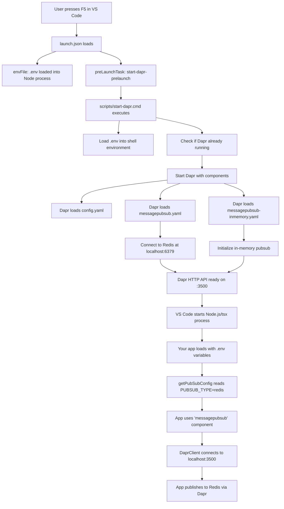

# Dapr System Architecture & Configuration Guide

This document provides a comprehensive walkthrough of how the Dapr subsystem is configured and operates within this TypeScript project.

## Table of Contents

- [System Architecture Overview](#system-architecture-overview)
- [Configuration Layers](#configuration-layers)
- [Component Definitions](#component-definitions)
- [VS Code Integration](#vs-code-integration)
- [Execution Flow](#execution-flow)
- [Key Benefits](#key-benefits)
- [Usage Instructions](#usage-instructions)
- [Troubleshooting](#troubleshooting)

## System Architecture Overview

```
┌─────────────────────────────────────────────────────────────────┐
│                    VS Code Debug Session                        │
├─────────────────────────────────────────────────────────────────┤
│  F5 Debug → launch.json → preLaunchTask → start-dapr.cmd       │
│                                    ↓                            │
│                          Load .env variables                    │
│                                    ↓                            │
│                      Start Dapr Sidecar                        │
│                                    ↓                            │
│                    Load Components & Config                     │
│                                    ↓                            │
│                    Your TypeScript App                         │
└─────────────────────────────────────────────────────────────────┘
```

## Component Discovery & Loading

### How Dapr Finds YAML Files

Dapr discovers component files through **command-line parameters** specified during startup. The discovery process is controlled by two key parameters:

#### 1. Resources Path Parameter
```bash
--resources-path ./components
```
- **Purpose**: Tells Dapr which directory to scan for component files
- **Behavior**: Dapr recursively scans this directory for `.yaml` files
- **File Patterns**: Only files ending in `.yaml` or `.yml` are processed
- **Exclusions**: Files with other extensions (like `.disabled`) are ignored

#### 2. Configuration File Parameter
```bash
--config ./components/config.yaml
```
- **Purpose**: Specifies the global Dapr configuration file location
- **Content**: Contains runtime settings, feature flags, and policies
- **Format**: Must be a valid YAML file following Dapr's Configuration schema

### Complete Startup Command

In our setup, the full Dapr startup command is:

```bash
dapr run \
  --app-id dapr-agents \
  --app-port 3000 \
  --dapr-http-port 3500 \
  --dapr-grpc-port 50001 \
  --max-body-size 16Mi \
  --log-level info \
  --resources-path ./components \      # ← Component discovery
  --config ./components/config.yaml   # ← Global configuration
```

### File Discovery Process

1. **Startup**: Dapr runtime starts with specified parameters
2. **Directory Scan**: Scans `./components` directory recursively
3. **File Filtering**: Identifies files with `.yaml` or `.yml` extensions
4. **YAML Parsing**: Attempts to parse each file as YAML
5. **Schema Validation**: Validates against Dapr component schemas
6. **Component Registration**: Registers valid components in the runtime
7. **Initialization**: Initializes each component with its configuration

### File Naming Conventions

| File Pattern | Status | Behavior |
|--------------|--------|----------|
| `*.yaml` | Active | Loaded and initialized |
| `*.yml` | Active | Loaded and initialized |
| `*.yaml.disabled` | Ignored | Skipped during discovery |
| `*.txt`, `*.md` | Ignored | Not processed by Dapr |
| `config.yaml` | Special | Global configuration (specified via `--config`) |

### Example Directory Structure

```
components/
├── config.yaml                      # Global Dapr config (--config parameter)
├── messagepubsub.yaml               # ✅ Loaded (Redis pubsub)
├── messagepubsub-inmemory.yaml      # ✅ Loaded (in-memory pubsub)  
├── azure-openai.yaml.disabled      # ❌ Ignored (disabled)
├── gpt-35-turbo.yaml.disabled       # ❌ Ignored (disabled)
└── README.md                        # ❌ Ignored (not YAML)
```

### Log Output During Discovery

When Dapr starts, you'll see logs indicating the discovery process:

```log
time="..." level=info msg="Loading components…"
time="..." level=warning msg="A non-YAML Component file azure-openai.yaml.disabled was detected, it will not be loaded"
time="..." level=info msg="Component loaded: messagepubsub (pubsub.redis/v1)"
time="..." level=info msg="Component loaded: messagepubsub-inmemory (pubsub.in-memory/v1)"
time="..." level=info msg="All outstanding components processed"
```

### Environment Variable Injection

During component loading, Dapr processes environment variable references:

```yaml
metadata:
- name: apiKey
  value: "{env:AZURE_OPENAI_API_KEY}"  # ← Resolved from environment
- name: endpoint  
  value: "{env:AZURE_OPENAI_ENDPOINT}" # ← Resolved from environment
```

**Resolution Order:**
1. Shell environment (from `.env` file via batch script)
2. Process environment (from VS Code launch configuration)
3. System environment variables

## Configuration Layers

### Layer 1: Environment Variables (.env file)

The `.env` file defines runtime configuration that can be dynamically changed without code modifications:

```env
# Azure OpenAI Configuration
AZURE_OPENAI_ENDPOINT="https://certo-open-ai.openai.azure.com/"
AZURE_OPENAI_API_KEY="mykey-4eb228bf610d41efb3c9da9394123476"
AZURE_OPENAI_DEPLOYMENT="one-lend-gpt-4o"
AZURE_OPENAI_API_VERSION="2025-01-01-preview"

# Pub/Sub Configuration
PUBSUB_TYPE=redis

# Optional: Dapr Configuration
# DAPR_HTTP_PORT=3500
# DAPR_GRPC_PORT=50001
# DAPR_LOG_LEVEL=debug
```

**Key Features:**
- Environment-driven configuration (no code changes needed)
- Support for multiple Azure OpenAI deployments
- Dynamic pub/sub backend switching
- Optional Dapr port customization

### Layer 2: Dapr Configuration File

**File: `components/config.yaml`**

```yaml
apiVersion: dapr.io/v1alpha1
kind: Configuration
metadata:
  name: dapr-config
spec:
  tracing:
    samplingRate: "1"
    stdout: true
  features:
    - name: "conversation"
      enabled: true
  accessControl:
    defaultAction: allow
```

**Purpose:**
- Global Dapr runtime settings
- Feature flag management (e.g., conversation API)
- Security and access control policies
- Distributed tracing configuration

### Layer 3: Component Definitions

Components are modular services that Dapr integrates with. Each component is defined in a separate YAML file following Dapr's component schema.

#### Component File Structure

Every Dapr component file follows this standard structure:

```yaml
apiVersion: dapr.io/v1alpha1           # Dapr API version
kind: Component                        # Resource type (Component, Configuration, etc.)
metadata:
  name: unique-component-name          # Unique identifier for the component
spec:
  type: component.type/version         # Component type and version
  version: v1                          # Component specification version
  metadata:                            # Component-specific configuration
  - name: setting1
    value: "value1"
  - name: setting2
    value: "{env:ENV_VAR_NAME}"       # Environment variable reference
scopes:                               # Optional: restrict component access
- dapr-agents                         # Only this app can use this component
```

#### Component Types in Our Setup

Our setup includes:

**1. Redis PubSub Component (`components/messagepubsub.yaml`)**

```yaml
apiVersion: dapr.io/v1alpha1
kind: Component
metadata:
  name: messagepubsub
spec:
  type: pubsub.redis
  version: v1
  metadata:
  - name: redisHost
    value: "localhost:6379"
  - name: redisPassword
    value: ""
  - name: redisDB
    value: "0"
scopes:
- dapr-agents
```

**2. In-Memory PubSub Component (`components/messagepubsub-inmemory.yaml`)**

```yaml
apiVersion: dapr.io/v1alpha1
kind: Component
metadata:
  name: messagepubsub-inmemory
spec:
  type: pubsub.in-memory
  version: v1
  metadata: []
scopes:
- dapr-agents
```

#### Disabled Components

**Azure OpenAI Component (`components/azure-openai.yaml.disabled`)**

```yaml
apiVersion: dapr.io/v1alpha1
kind: Component
metadata:
  name: azure-openai
spec:
  type: conversation.azure.openai
  version: v1
  metadata:
  - name: apiKey
    value: "{env:AZURE_OPENAI_API_KEY}"
  - name: endpoint
    value: "{env:AZURE_OPENAI_ENDPOINT}"
  - name: deploymentName
    value: "{env:AZURE_OPENAI_DEPLOYMENT_NAME}"
  - name: apiVersion
    value: "{env:AZURE_OPENAI_API_VERSION}"
scopes:
- dapr-agents
```

**Note:** Components with `.disabled` extension are ignored by Dapr. Rename to `.yaml` to enable.

## VS Code Integration

### Debug Configuration (.vscode/launch.json)

```json
{
  "name": "Debug File",
  "type": "node",
  "request": "launch",
  "program": "${workspaceFolder}/${file}",
  "envFile": "${workspaceFolder}/.env",
  "env": {
    "NODE_ENV": "development",
    "DAPR_HTTP_PORT": "3500",
    "DAPR_GRPC_PORT": "50001"
  },
  "preLaunchTask": "start-dapr-prelaunch",
  "postDebugTask": "daprd-down-agents"
}
```

**Key Features:**
- Automatic environment loading from `.env` file
- Pre-launch Dapr startup
- Post-debug cleanup
- TypeScript debugging with source maps

### Task Configuration (.vscode/tasks.json)

```json
{
  "label": "start-dapr-prelaunch",
  "type": "shell",
  "command": "cmd",
  "args": ["/c", "${workspaceFolder}\\scripts\\start-dapr.cmd"]
}
```

**Purpose:**
- Automates Dapr sidecar startup
- Ensures proper component loading
- Provides consistent development environment

### Dapr Startup Script (scripts/start-dapr.cmd)

```batch
@echo off
echo Starting Dapr sidecar for debugging...

REM Load environment variables from .env file
echo Loading environment from .env file...
if exist .env (
    for /f "eol=# tokens=1,* delims==" %%a in (.env) do (
        if "%%b" neq "" (
            set "%%a=%%b"
            echo    Loaded: %%a
        )
    )
)

REM Start Dapr with proper configuration
start /B dapr run --app-id dapr-agents --app-port 3000 --dapr-http-port 3500 --dapr-grpc-port 50001 --max-body-size 16Mi --log-level info --resources-path ./components --config ./components/config.yaml

REM Wait for Dapr health check
:wait_loop
timeout /t 2 /nobreak >nul
curl -s http://localhost:3500/v1.0/healthz >nul 2>&1
if %errorlevel% == 0 (
    echo Dapr is ready!
    goto :end
)
echo Still waiting for Dapr...
goto :wait_loop
```

**Key Functions:**
- Environment variable injection from `.env` file
- Duplicate process prevention
- Health check verification
- Proper component and config loading

## Application Code Integration

### Dynamic PubSub Configuration

**File: `src/utils/pubsub.ts`**

```typescript
export interface PubSubConfig {
  componentName: string;
  type: 'redis' | 'inmemory';
  description: string;
}

export function getPubSubConfig(): PubSubConfig {
  const pubsubType = (process.env.PUBSUB_TYPE || 'redis').toLowerCase() as 'redis' | 'inmemory';
  
  const configs: Record<string, PubSubConfig> = {
    redis: {
      componentName: 'messagepubsub',
      type: 'redis',
      description: 'Redis-based pubsub (production-ready, persistent)'
    },
    inmemory: {
      componentName: 'messagepubsub-inmemory',
      type: 'inmemory',
      description: 'In-memory pubsub (testing/development, not persistent)'
    }
  };

  return configs[pubsubType];
}
```

**Benefits:**
- Runtime component selection
- Type-safe configuration
- Environment-driven behavior
- Development/production flexibility

## Component Loading Workflow

### Step-by-Step Component Discovery

Here's exactly what happens when Dapr starts and discovers your component files:

#### Phase 1: Startup and Parameter Processing
1. **Command Execution**: Batch script executes `dapr run` command
2. **Parameter Parsing**: Dapr runtime processes command-line parameters
3. **Path Resolution**: `--resources-path ./components` is resolved to absolute path
4. **Config Loading**: `--config ./components/config.yaml` is loaded first

#### Phase 2: File System Scanning
1. **Directory Traversal**: Dapr scans the components directory
2. **File Enumeration**: Lists all files in the directory
3. **Extension Filtering**: Filters for `.yaml` and `.yml` files only
4. **Exclusion Logic**: Ignores files with other extensions

#### Phase 3: YAML Processing
1. **File Reading**: Each YAML file is read from disk
2. **YAML Parsing**: Content is parsed as YAML syntax
3. **Schema Validation**: Validates against Dapr component schemas
4. **Metadata Extraction**: Extracts component name, type, and configuration

#### Phase 4: Environment Variable Resolution
1. **Pattern Detection**: Scans for `{env:VARIABLE_NAME}` patterns
2. **Environment Lookup**: Resolves variables from process environment
3. **Value Substitution**: Replaces patterns with actual values
4. **Validation**: Ensures all required variables are resolved

#### Phase 5: Component Registration
1. **Type Resolution**: Determines component type (pubsub, state, binding, etc.)
2. **Provider Loading**: Loads the appropriate component provider/driver
3. **Instance Creation**: Creates component instance with configuration
4. **Health Check**: Validates component connectivity and functionality

#### Phase 6: Runtime Integration
1. **API Registration**: Registers component with Dapr HTTP/gRPC APIs
2. **Scope Application**: Applies component scopes and access controls
3. **Lifecycle Management**: Starts component background processes
4. **Readiness Signal**: Marks component as ready for use

### Real-World Example Log Sequence

Here's what you see in the logs during component loading:

```log
# Phase 1-2: Discovery
time="..." level=info msg="Loading components…" 
time="..." level=warning msg="A non-YAML Component file azure-openai.yaml.disabled was detected, it will not be loaded"

# Phase 3-4: Processing
time="..." level=debug msg="Processing component file: messagepubsub.yaml"
time="..." level=debug msg="Resolved environment variable: REDIS_HOST=localhost:6379"

# Phase 5-6: Registration
time="..." level=info msg="Component loaded: messagepubsub (pubsub.redis/v1)"
time="..." level=info msg="Component loaded: messagepubsub-inmemory (pubsub.in-memory/v1)"
time="..." level=info msg="All outstanding components processed"
```

### Component State Management

Once loaded, components have the following states:

| State | Description | API Access |
|-------|-------------|------------|
| **Loading** | Component is being initialized | ❌ Not available |
| **Ready** | Component is operational | ✅ Fully available |
| **Error** | Component failed to initialize | ❌ Not available |
| **Disabled** | Component was disabled via scopes | ❌ Access denied |

### Dynamic Component Management

You can manage components at runtime:

#### Enable a Component
```bash
# Rename to enable
ren components\azure-openai.yaml.disabled azure-openai.yaml
# Restart Dapr to pick up changes
dapr stop --app-id dapr-agents
# Start again - component will be loaded
```

#### Disable a Component
```bash
# Rename to disable
ren components\azure-openai.yaml azure-openai.yaml.disabled
# Restart Dapr - component will be ignored
```

#### Check Component Status
```bash
# List all loaded components
curl http://localhost:3500/v1.0/components

# Check specific component health
curl http://localhost:3500/v1.0/healthz
```

## Execution Flow



### Detailed Step-by-Step Process

1. **Debug Initiation**
   - User presses F5 or starts debugging in VS Code
   - `launch.json` configuration is loaded

2. **Environment Setup**
   - `.env` file is loaded into the Node.js process environment
   - Additional environment variables are set (NODE_ENV, DAPR ports)

3. **Pre-Launch Task Execution**
   - `start-dapr-prelaunch` task is triggered
   - `scripts/start-dapr.cmd` batch script executes

4. **Dapr Sidecar Startup**
   - Environment variables are loaded from `.env` into shell
   - Existing Dapr processes are checked and stopped if necessary
   - New Dapr sidecar starts with proper configuration

5. **Component Loading**
   - Dapr loads `config.yaml` for global settings
   - Each `.yaml` file in `components/` directory is processed
   - Components are initialized and validated

6. **Application Launch**
   - VS Code starts the Node.js/tsx process
   - Application code begins execution
   - Environment variables are available to the app

7. **Runtime Operation**
   - App reads configuration from environment
   - Dynamic component selection based on `PUBSUB_TYPE`
   - DaprClient connects to local sidecar
   - Business logic executes with Dapr integration

## Key Benefits

### Development Experience
✅ **One-Click Debugging**: F5 starts everything automatically  
✅ **Environment Isolation**: Different configs for dev/test/prod  
✅ **Hot Configuration**: Change settings without code changes  
✅ **Type Safety**: Full TypeScript support throughout  

### Operational Flexibility
✅ **Component Switching**: Enable/disable services by file renaming  
✅ **Backend Flexibility**: Switch between Redis/in-memory easily  
✅ **Model Flexibility**: Support any Azure OpenAI deployment  
✅ **Scalable Architecture**: Easy to add new components  

### Production Readiness
✅ **Configuration Management**: Environment-driven deployment  
✅ **Service Discovery**: Dapr handles service communication  
✅ **Observability**: Built-in tracing and monitoring  
✅ **Security**: Access control and service isolation  

## Usage Instructions

### Quick Start

1. **Start Debugging**
   ```
   Press F5 in VS Code with any TypeScript file open
   ```

2. **Switch PubSub Backend**
   ```bash
   npx tsx switch-pubsub.ts redis     # Use Redis
   npx tsx switch-pubsub.ts inmemory  # Use in-memory
   ```

3. **Switch AI Model**
   ```bash
   npx tsx switch-model.ts gpt-4
   npx tsx switch-model.ts your-deployment-name
   ```

4. **Enable/Disable Components**
   ```bash
   # Enable Azure OpenAI
   ren components\azure-openai.yaml.disabled azure-openai.yaml
   
   # Disable a component
   ren components\azure-openai.yaml azure-openai.yaml.disabled
   ```

### Configuration Management

#### Environment Variables

Edit `.env` file to change runtime behavior:

```env
# Switch between backends
PUBSUB_TYPE=redis          # or 'inmemory'

# Change AI deployment
AZURE_OPENAI_DEPLOYMENT=gpt-4    # or any deployment name

# Customize Dapr ports
DAPR_HTTP_PORT=3500
DAPR_GRPC_PORT=50001
```

#### Component Management

- **Active**: Files with `.yaml` extension are loaded
- **Disabled**: Files with `.yaml.disabled` extension are ignored
- **Add New**: Create new `.yaml` files in `components/` directory

### Debugging Tips

1. **Check Dapr Status**
   ```bash
   dapr list
   ```

2. **View Dapr Logs**
   ```bash
   dapr logs --app-id dapr-agents
   ```

3. **Test Connectivity**
   ```bash
   curl http://localhost:3500/v1.0/healthz
   ```

4. **Redis Connectivity**
   ```bash
   docker exec dapr_redis redis-cli ping
   ```

## Troubleshooting

### Common Issues

#### 1. Dapr Startup Failures

**Symptoms:**
- "Component not found" errors
- Fatal initialization errors
- Port binding failures

**Solutions:**
- Check `.env` file for missing/invalid API keys
- Verify component YAML syntax
- Ensure no port conflicts (3500, 50001)
- Disable problematic components temporarily

#### 2. Component Loading Issues

**Symptoms:**
- "pubsub messagepubsub is not found"
- Component initialization errors

**Solutions:**
- Restart Dapr sidecar after component changes
- Check component file naming (must end in `.yaml`)
- Verify component metadata and configuration
- Check Redis connectivity for Redis components

#### 3. Environment Variable Problems

**Symptoms:**
- API key not found errors
- Wrong configuration being used

**Solutions:**
- Verify `.env` file exists and has correct values
- Check environment loading in batch script
- Ensure no quotation mark issues in `.env`
- Restart debugging session after `.env` changes

#### 4. VS Code Integration Issues

**Symptoms:**
- Pre-launch task failures
- Debug session won't start
- Breakpoints not hitting

**Solutions:**
- Check task configuration in `tasks.json`
- Verify batch script permissions and paths
- Ensure tsx is installed (`npm install -g tsx`)
- Check source map configuration

### Diagnostic Commands

```bash
# Check Dapr status
dapr list

# Check component health
curl http://localhost:3500/v1.0/components

# View current configuration
npx tsx switch-pubsub.ts
npx tsx switch-model.ts

# Test Redis connectivity
docker exec dapr_redis redis-cli ping

# Check environment loading
npx tsx -e "console.log(process.env.PUBSUB_TYPE)"
```

### Log Analysis

**Important Log Messages:**
- ✅ `Component loaded: messagepubsub (pubsub.redis/v1)`
- ✅ `HTTP server is running on port 3500`
- ✅ `You're up and running! Dapr logs will appear here`
- ❌ `Failed to init component`
- ❌ `missing the OpenAI API key`
- ❌ `couldn't find conversation`

## File Structure Reference

```
typescript/
├── .env                          # Environment configuration
├── .vscode/
│   ├── launch.json              # Debug configuration
│   └── tasks.json               # Task automation
├── components/
│   ├── config.yaml              # Dapr global config
│   ├── messagepubsub.yaml       # Redis pubsub
│   ├── messagepubsub-inmemory.yaml  # In-memory pubsub
│   ├── azure-openai.yaml.disabled  # Azure OpenAI (disabled)
│   └── gpt-35-turbo.yaml.disabled  # OpenAI (disabled)
├── scripts/
│   └── start-dapr.cmd           # Dapr startup script
├── src/
│   └── utils/
│       └── pubsub.ts            # Dynamic pubsub config
├── switch-pubsub.ts             # PubSub switching utility
├── switch-model.ts              # Model switching utility
└── docs/
    └── architecture/
        └── dapr-configuration-guide.md  # This document
```

---

*Last updated: October 1, 2025*
*For questions or improvements, please create an issue or contribute to the documentation.*